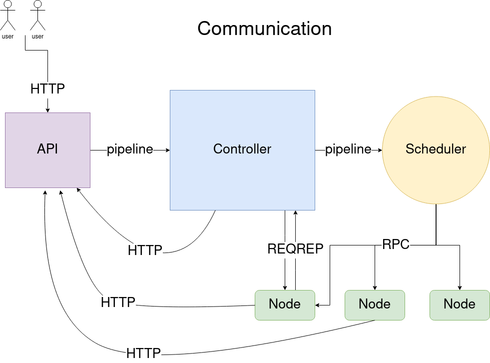
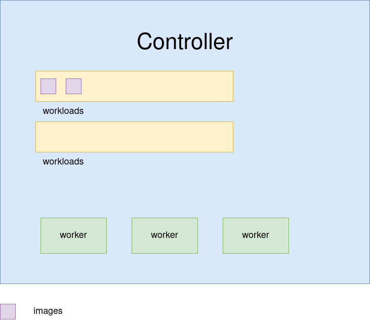

# architecture document

## communication architecture

here you can see the communication protocols that are used across the system

we focused on [orthogonality][def-ort] when designing this project. Meaning,
each component you see in the architecture can in fact run independently. You
could launch the API in a server in UK, then the controller in Mexico, the
scheduler in US and the system wouldn't know the difference.

## controller

here is a close up to the controller

